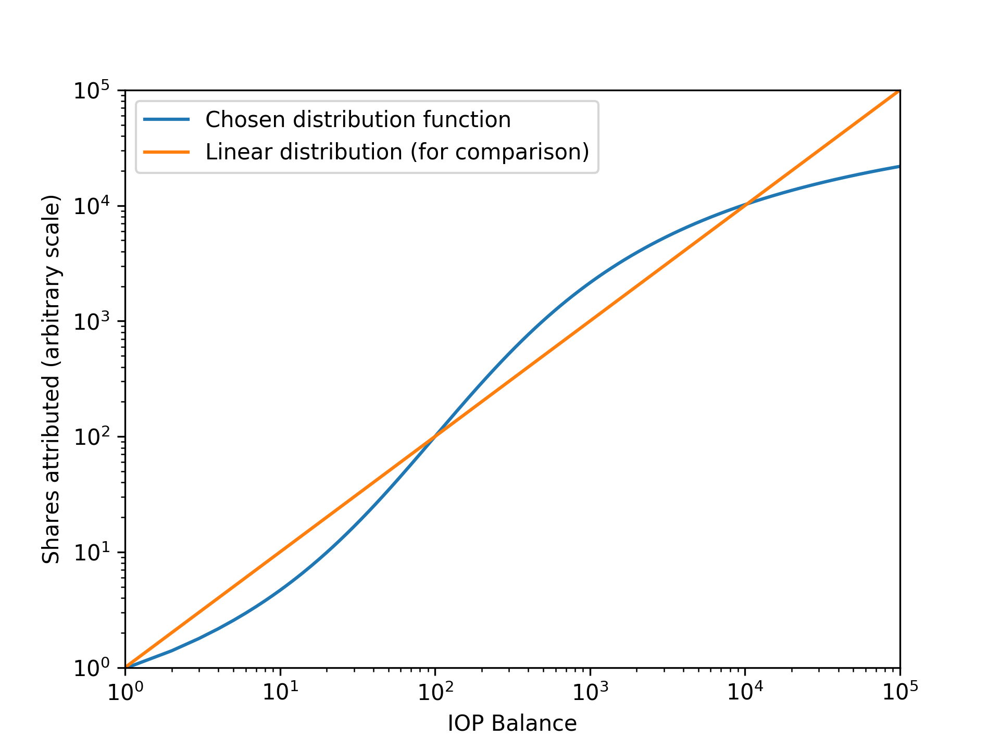

Second Hydra Airdrop
====================

**UPDATE** - Added a .jar tool for batch registering many IOP addresses at once, see below. Also, 

**UPDATE** - All snapshots and distribution calculations added. Our Telegram CommunityBot is now accepting your registrations. The registration will be open for 7 days, until Sunday, January 14, 7 PM UTC, so everyone has plenty of time to claim their tokens. We also added a .jar tool for batch registering all IOP addresses in your IoP Core wallet at once.

Dear IOP Community,

Initially we planned to open registration for the second airdrop of Hydra tokens on Monday, January 1, 2:00 PM UTC. Due to the large amount of new members during the Christmas period and the increased demand for another airdrop, we have decided to extend this airdrop by adding a second round. The rewards for both rounds can be claimed together starting on January 7, 7:00 PM UTC. 

The first round began with the first block after midnight on December 25 (UTC) and ended with the first block after midnight on December 31. The second round began with the first block after midnight on January 1 (UTC) and ended with the first block after midnight on January 7.

This time, each eligible address was awarded a fixed amount of Hydra, which has been determined during the two rounds mentioned above. An address is eligible for the airdrop if it contained more than 1 IOP for more than half of one of the snapshot phases. Details on the distribution method are given below. 

In the first round, 1621 addresses held an eligible balance, while in the second round, this figure increased to 1683. Of those eligible, no address was awareded less than 0.1 HYD per round, and no address was awarded more than 3335 HYD per round. To claim your Hydra, please follow the instructions below. Unclaimed Hydra will be saved for distribution in the next airdrop.

Claiming HYD Tokens
===================

To take part and receive your Hydra tokens, you need a valid Ethereum address **for which you control the private key**. You can register for the airdrop using the IoPCommunityBot in our official [Telegram Channel](https://t.me/IoPofficial). Please talk to the bot using private messages, to keep the channel clear for people asking questions. 

The command used for claiming an IOP address is `/%register YOUR_IOP_ADDRESS YOUR_ETH_ADDRESS SIGNATURE`. In this, `YOUR_IOP_ADDRESS` is the IOP address you want to claim and `YOUR_ETH_ADDRESS` is the address you want to receive the Hydra on. `SIGNATURE` is generated by using the *Sign Message* function of your IoP Core wallet. Enter your Ethereum address in the message field, without any other symbols or whitespace. Choose the IOP address you want to register and click *Sign*. Copy the resulting signature into the command for the telegram bot. This is used to verify that you indeed own the IOP address you want to register.

A very helpful video has already been uploaded to our official Internet of People YouTube Channel, explaining how to [register for the first Hydra Airdrop](https://youtu.be/hvMySKfQZ7Q). The procedure is exactly the same for the second airdrop. The only difference is that the second airdrop is not a lottery, so the amount of tokens is already fixed when you register.

We also have a Java-based (works on Windows, Linux, MacOS...) command line tool to register all your addresses at once, including the ones the wallet doesn't show unless you run *listaddressgroupings*. It can be found [here](src/register/jar/ClaimAirdrop.jar). To use it, see the steps listed [here](https://github.com/libertaria-project/hydra-airdrop-2/blob/master/src/register/jar/README.md). Please verify at least the MD5 hash of the jar. You can do this [here](http://onlinemd5.com) after downloading the jar.

Distribution Method
===================
We monitored the blockchain twice, each time over a period of seven days, using 7 snapshots taken from the first block after midnight each day. Addresses enter the airdrop using the balance they held for at least 4 of the 7 snapshots. The intent behind this method is to reward people who see IOP as a project worth of long-term investment.

Our first airdrop was held as a lottery to give owners of smaller wallets a chance to win more Hydras; however, this time we want to reward the people who have put their trust into our ecosystem, people who share our vision of people interacting and cooperating freely. For this reason we have chosen a distribution function that rewards addresses with mid-range balances more than addresses with low or very high balances. An address is eligible for the airdrop if it contains more than 1 IOP. The exact details will only be revealed during the second round of airdropping to prevent people from trying to game the system. However, if you have a lot of small change laying around in your wallet, we recommend sending it all to yourself in a single large transaction.

**UPDATE** Now that all snapshots are done, we are revealing our distribution function. It is described by
`shares(coins) = 100^( arctan( (log10(coins)/2 - 1) * pi/2 ) + 1 )` and is shown in the following graphic. As you can see, addresses with a balance from 100 IOP to 10,000 IOP are slightly preferred in this airdrop, while addresses with a balance outside this range are increasingly penalized the further they are from the given range.

After all shares have been distributed, we calculate the total number of shares and adjust the number of HYD tokens per share accordingly. The two rounds are calculated separately. You can see the amount of HYD tokens each address won [here](src/data/combined/hydras.json).

I received fewer Hydras than expected
=====================================

If you find an address is credited with fewer Hydras than expected, please remember that your wallet generates change addresses every time you send a transaction. See [this article](https://iop.global/change-addresses/) for more information. Depending on their balance during the snapshot phases, these addresses might also be eligible. You can get a list of all addresses in your wallet--including change addresses--by running `listaddressgroupings` in the console found in your IoP Core Wallet under *Help->Debug Window->Console*. To find out which of these is eligible for registration, you can compare them against the calculated result [here](src/data/combined/hydras.json). 
Registration will be open until Sunday, January 14, 2:00 PM UTC. After registration closes, we will update this repository with the full registration data. 

# FAQ

If you still have questions, you should be able to find the answers here.

**Q**: What is an airdrop?
**A**: An airdrop is a distribution of free cryptocurrency to holders of a different currency. It’s a way to establish a broad base of token holders, reward a certain group of people or just generate buzz for a new token.

**Q**: Does it cost anything?
**A**: No, an airdrop is a free gift.

**Q**: Why is this airdrop happening? Who is it for?
**A**: To celebrate the long-standing partnership between IoP and Libertaria, Libertaria is rewarding members of the IoP community with a free gift of Hydra, Libertaria’s new cryptotoken.

**Q**: What is Hydra?
**A**: Hydra is Libertaria’s new cryptotoken. Eventually it will run on Libertaria’s new Hydra blockchain protocol, but for now it is an ERC20 token on the Ethereum blockchain. The address of the contract is 0xd233495c48eb0143661ffc8458eafc21b633f97f, the Token symbol is **HYD** and uses 12 digits.

**Q**: How many Hydra tokens are being airdropped?
**A**: 500,000 Hydra tokens are being distributed in this airdrop.

**Q**: Is everyone eligible to receive free Hydra tokens?
**A**: No, only IOP addresses containing more than 1 IOP for at least 4 of the 7 snapshots per round are eligible to receive tokens in this airdrop. The requirements for participation will change for each airdrop.

**Q**: Will every eligible address receive free Hydra tokens?
**A**: Yes. The minimum amount each address will receive will be revealed here as soon as it is known.

**Q**: Can I receive Hydra from my IOP on Bittrex?
**A**: No, you cannot receive Hydra tokens based on Bittrex holdings. Only IOP addresses for which you own the private keys are eligible to register for the airdrop.

**Q**: What are the important dates for this airdrop?
**A**: 
- From December 25 to December 31: Snapshots for round 1, always at the first block after midnight UTC.
- From January 1 to January 7: Snapshots for round 2, always at the first block after midnight UTC. 
- January 2: Release of the snapshot results for round 1. You can start to compare your addresses.
- January 7: Release of the snapshot results for round 2. Release of the full mathematical details on the distribution function for transparency.
- From January 7 to January 14: Register your addresses with the bot in our official [Telegram Channel](https://t.me/IoPofficial) (starting and closing at 7 PM UTC, respectively).
- After January 14: Hydras will be sent out to all registered participants.

**Q**: What do I need to register my address?
**A**: You’ll need an eligible IOP address, an Ethereum wallet address for a wallet supporting ERC20 tokens and an IOP wallet capable of signing a message using the private key for the eligible IOP address. The official IoP Core wallet is perfect for this, the mobile wallet and exchange addresses are NOT. Another possibility is to use the Coinomi wallet.

**Q**: Which wallets support ERC20 tokens?
**A**: There are several options, but we recommend MyEtherWallet.com. We have created a short instructional video explaining how to set up a wallet address in MEW.

**Q**: How do I register my address?
**A**: You can register your address in our official IoP Token telegram channel by messaging our bot. The bot also accepts direct messages.

**Q**: The bot says I need a signature. What’s that?
**A**: We need a cryptographic signature to verify that you own the IoP address you’re trying to register. In your IoP core wallet, select “Sign Message” from the File menu. Paste the eligible IoP address in the top bar and your ETH address in the message box. Click the “Sign Message” button and the signature will be generated. You can use the Copy button to the right of the signature to copy it to the clipboard.

**Q**: The bot said: “That IoP address isn't on the list of IoP addresses eligible for this airdrop. Sorry.” Why?
**A**: First check these lists for for your address: [round 1](src/data/round1/balances_eligible.json) and [round 2](src/data/round2/balances_eligible.json). If the balance there does not match what you think you had in that address, compare against these lists: [round 1](src/data/round1/all_balances_chronological.json), [round 2](src/data/round2/all_balances_chronological.json), where the balance for each of the snapshots is listed. Remember you need a balance of at least 1 IOP to receive Hydras, and only balances held for more than 4 days are eligible. If the address is not in the list, don’t worry. Your tokens may have been stored in a different address than you think. Go to *Help->Debug Window->Console*, enter `listaddressgroupings` and hit return. The console window will display all the addresses your wallet used for your transactions. Check that list against the first list and you should find the tokens you’re looking for.

